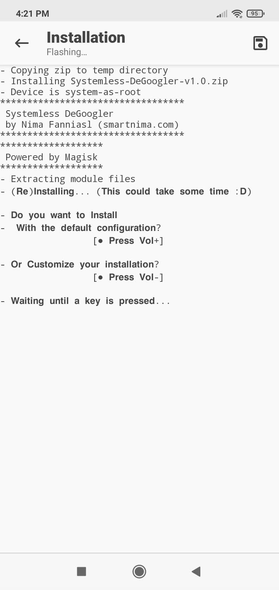
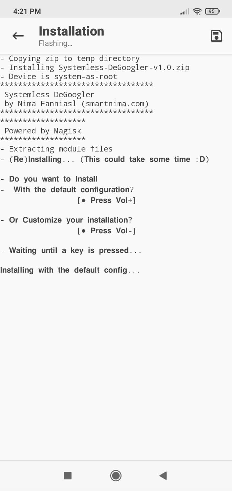
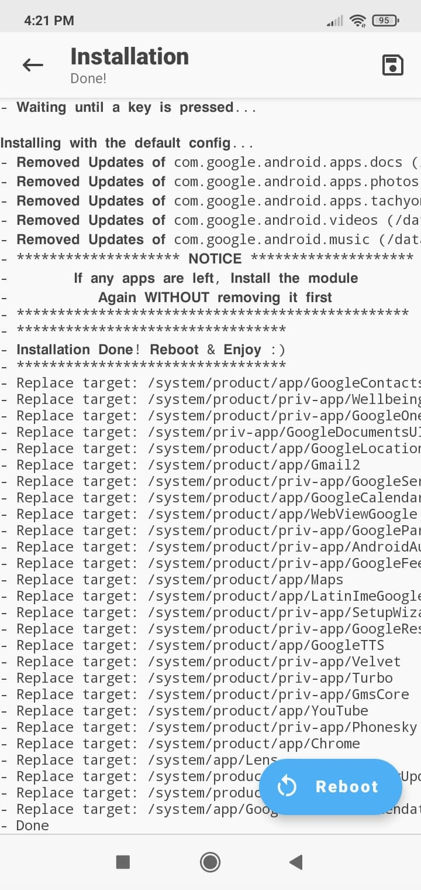
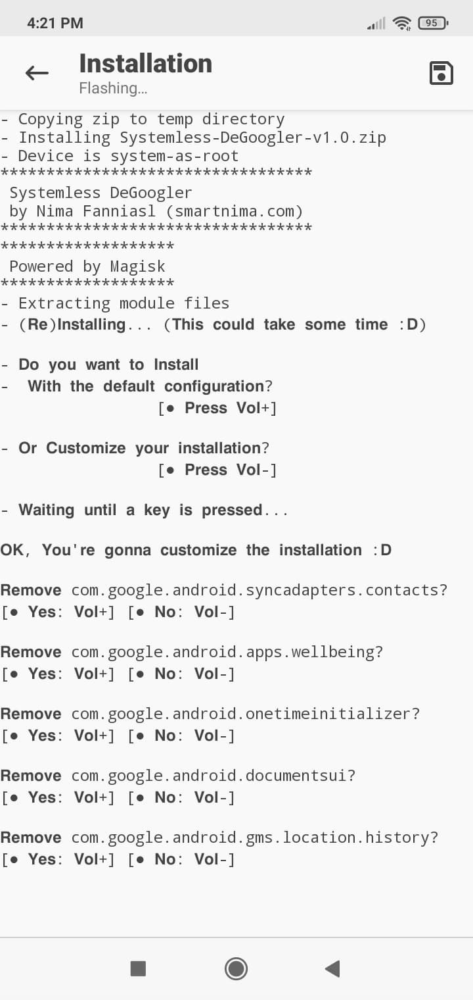
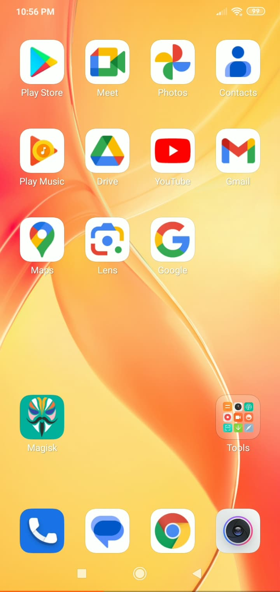
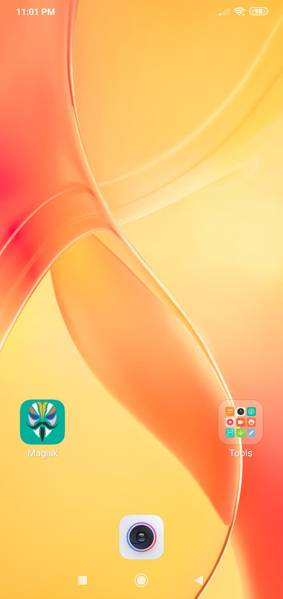
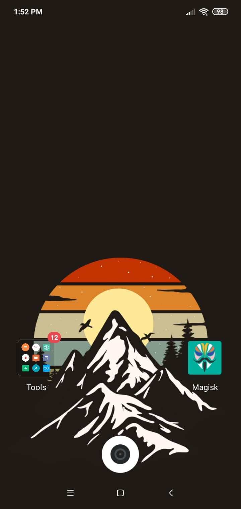
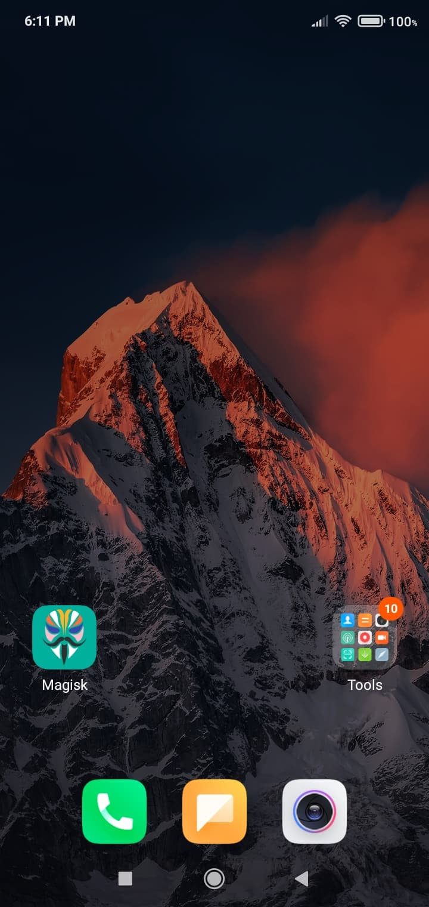

### DeGoogle your phone without any risk and hassle!

Being systemless means that if anything goes wrong or you don't feel like DeGoogle-ing anymore, you can just disable the module from Magisk Manager easily with one click, or remove it with your recovery from /data/adb/modules :)
This module doesn't leave anything permanent on your phone and everything is revertable to the original state just by disabling the module :D

### Screenshots of the installation process:

  
Waiting to choose Installation method

  

  
Default Installation

  
  

  
Custom Installation

  

### Tested on:

  
MIUI 10 (Android 9)

  
  

  
MIUI 11 (Android 10)

  
  

  
MIUI 12.5 (Android 10)

  
  

Pixel Experience (Android 14)

LineageOS (Android 14) + NikGapps Full
